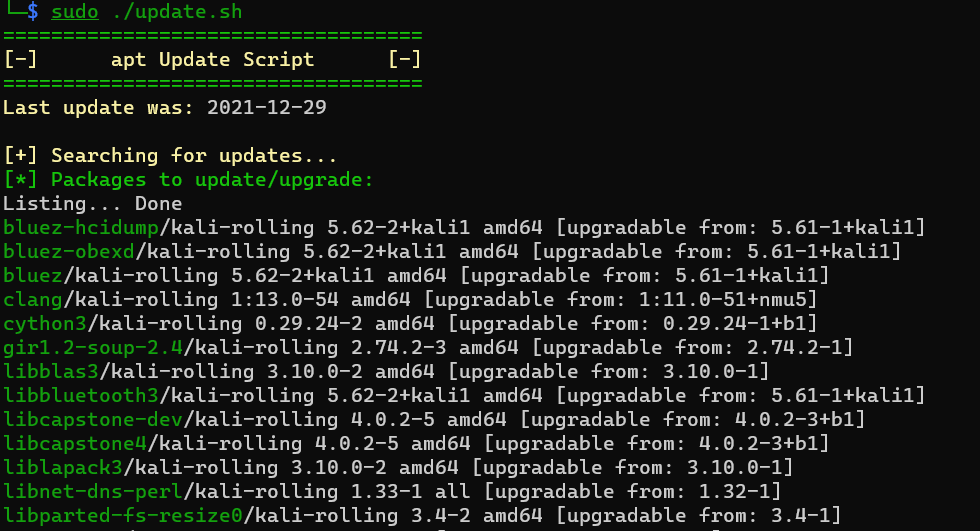
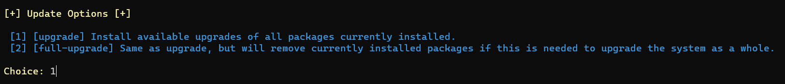
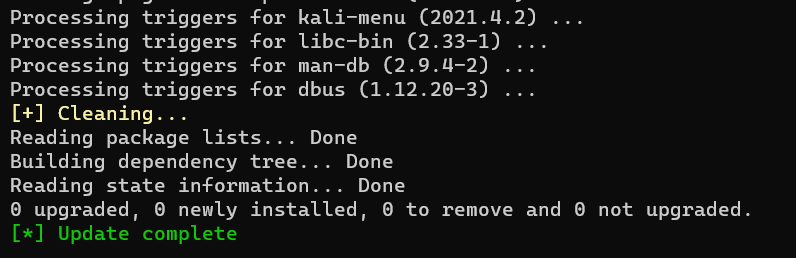
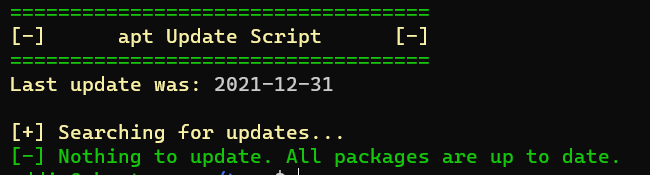

# Debian APT Update Script

Simple Script that uses apt to update Debian based systems.

## Description

If I have to type something more than once then I will create an automated process. That's why this script exists. 

This script basically updates your Debain system using the apt command.

- apt update
- apt upgrade
- apt full-upgrade

## Getting Started

### Dependencies

- Debian Based Distro
- Tested on Ubuntu, Mint, and Kali

### Installing

1. `sudo git clone https://github.com/a13xdagr8/debian-update.git`
2. `cd debian-update`
3. `sudo chmod +x update.sh`

### Executing/Running

1. `cd` to debian-update
2. `sudo ./update.sh`

## Screenshots

